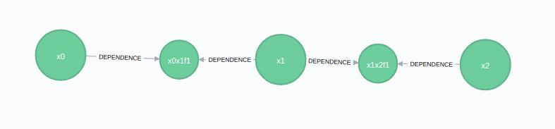

# Adding Variables and Factors (Building Graphs)

Irrespective of your application - real-time robotics, batch processing of survey data, or really complex multi-hypothesis modeling - you're going to need to need to add factors and variables to a graph. This section discusses how to do that with SlamInDb/Graff:
* For the frequently-occurring cases, like streaming robotics, we have added convenience methods. We will also continue to do so for other scenarios, hopefully incrementally building easier/cleaner libraries and expertise for the wide variety of solutions that SlamInDb/Graff can solve. Right now, we have a convenience methods for building graphs from streams of odometry data (e.g. an LCM log or a ROS bag file).  
* We also have lower-level methods, more generalized calls to add variables and factors.

## A Quick Discussion on IsReady

Ideally, we want to solve any updated graph as quickly as possible. We're actually architecting the underlying solver structure to do that the moment new data becomes available, so in an ideal world, there is no such thing as a ready graph that doesn't have a solution yet.

However, in some scenarios you want to incrementally build graphs and then let it solve. The IsReady flag on variables provides you with a means to delay that solving.

In a simple scenario, imagine that you want to add two variables (x1 and x2) and relate them with a shared landmark. You may want to delay solving until you've provided all the information. This can be done with the IsReady flag:
* Add x1 pose with isReady = false
* Add x2 pose with isReady = false
* Add l1 landmark with isReady = false
* Create odometry factor between x1 and x2 (I moved from x1 to x2 and the new factor contains the odometry difference)
* Create bearing+range factor between x1 and l1 (I saw something in x1)
* Create bearing+range factor between x2 and l1 (I saw the same something in x2)
* Call PutReady for this set of nodes
* -> Solver will detect new data and run off to solve it

Last note of this: Some methods automatically set IsReady to true (such as the addOdometryMeasurement convenience functions) - this is great for examples and continuous incremental solving. That means that you don't need to worry about it, and when we discuss those methods we'll try indicate which automatically set it.

## High-Level Convenience Functions for Adding Data to a Graff

### Adding Odometry Data

Adding odometry data creates everything all at once for a standard 2D factor of type (x, y, angle). It creates a new variable (say x2) at the end of the graph, links it to the last variable (x1) via a Pose2Pose2 factor, and updates IsReady flags to true.

Just create the AddOdometryRequest request and fire it off:

```julia
deltaMeasurement = [1.0; 1.0; pi/4] # x2's pose is (1, 1) away from x1 and the bearing increased by 45 degrees   
pOdo = Float64[0.1 0 0; 0 0.1 0; 0 0 0.01] # Uncertainty in the measurement is in pOdo along the principal diagonal, i.e. [0.1, 0.1, 0.01]
newOdo = AddOdometryRequest(deltaMeasurement, pOdo)
@show addOdoResponse = addOdometryMeasurement(synchronyConfig, newOdo)

# Above would produce x1 in an empty graph.
# Let's run again to produce x2 - assuming the robot travelled the same delta measurement
@show addOdoResponse = addOdometryMeasurement(synchronyConfig, newOdo)
```

The result would be the following image if run against an empty session:



### Adding and Attaching Landmarks

We may have seen the same identifying feature in both x1 and x2 (eg. an AprilTag), and want to represent this information. There is a convenience function addBearingRangeFactor that is used to add the factor between the landmark and the variable.

Technically adding landmarks is a lower-level function (addVariable), but in this scenario we want to show the binding of the landmark to variables, so we need to add a landmark with a addVariable call:

```julia
newLandmark = VariableRequest(
  "l1", #The variables label
  "Point2", #The type of variable - in this instance it's a 2D point in space, refer to Variable Types section below for the other variable types
  ["LANDMARK"]) #Labels - we are identifying this as a landmark for readability
response = addVariable(synchronyConfig, newLandmark)
```

We now create the factors to link x1 to l1, and x2 to l1 respectively. The factors are type specific (in this case, relating a 2D position+angle to a 2D point), and include a distribution capturing the uncertainty. You don't need to make them normal distributions, but that's a discussion for later:

```julia
newBearingRangeFactor = BearingRangeRequest("x1", "l1",
                          DistributionRequest("Normal", Float64[0; 0.1]), # A statistical measurement of the bearing from x2 to l1 - normal distribution with 0 mean and 0.1 std
                          DistributionRequest("Normal", Float64[20; 1.0]) # A statistical measurement of the range/distance from x2 to l1 - normal distribution with 0 mean and 0.1 std
                          )
addBearingRangeFactor(synchronyConfig, newBearingRangeFactor)
```

We can add another one between x2 and l1:

```julia
newBearingRangeFactor = BearingRangeRequest("x2", "l1",
                          DistributionRequest("Normal", Float64[-pi/4; 0.1]), # A statistical measurement of the bearing from x1 to l1 - normal distribution with 0 mean and 0.1 std
                          DistributionRequest("Normal", Float64[18; 1.0]) # A statistical measurement of the range/distance from x1 to l1 - normal distribution with 0 mean and 0.1 std
                          )
addBearingRangeFactor(synchronyConfig, newBearingRangeFactor)
```

The graph would then become:


### Attaching Sensor Data

[TODO]

## Low-Level Functions for Adding Data to a Graff

### Adding Variables

Variables (a.k.a. poses in localization terminology) are created in the same way  shown above for the landmark. Variables contain a label, a data type (e.g. a 2D Point or Pose). Note that variables are solved - i.e. they are the product, what you wish to calculate when the solver runs - so you don't provide any measurements when creating them.

For example, we can define x1 as follows:
```julia
x1Request = VariableRequest("x1", "Pose2")
response = addVariable(synchronyConfig, x1Request)

x2Request = VariableRequest("x2", "Pose2", ["AdditionalLabel"])
response = addVariable(synchronyConfig, x2Request)
```

We can also provide additional labels in the request, as was done with the landmark, to help identify the variables later:

```julia
newLandmark = VariableRequest("l1", "Point2", ["LANDMARK"])
response = addVariable(synchronyConfig, newLandmark)
```

NOTE: These are by default created with IsReady set to false. The assumption is that you are building lower-level elements, so you should call putReady once you want these nodes to be solved.

#### Variable Types
If you have installed RoME, you can check for the latest variable types with:

```julia
using RoME
subtypes(IncrementalInference.InferenceVariable)
```

The current list of available variable types is:
* Point2 - A 2D coordinate
* Point3 - A 3D coordinate
* Pose2 - A 2D coordinate and a rotation (i.e. bearing)
* Pose3 - A 3D coordinate and 3 associated rotations
* DynPoint2 - A 2D coordinate and linear velocities
* DynPose2 - A 2D coordinate, linear velocities, and a rotation


### Adding Factors

[TODO]

### Factor Types
If you have installed RoME, you can check for the latest factor types with:

```julia
using RoME
subtypes(IncrementalInference.FunctorPairwise)
```

The current factor types that you will find in the example are (there are many aside from these):

* Point2Point2 -
* Point2Point2WorldBearing -
* Pose2Point2Bearing -
* Pose2Point2BearingRange -
* Pose2Point2Range -
* Pose2Pose2 -
* Pose3Pose3 -
